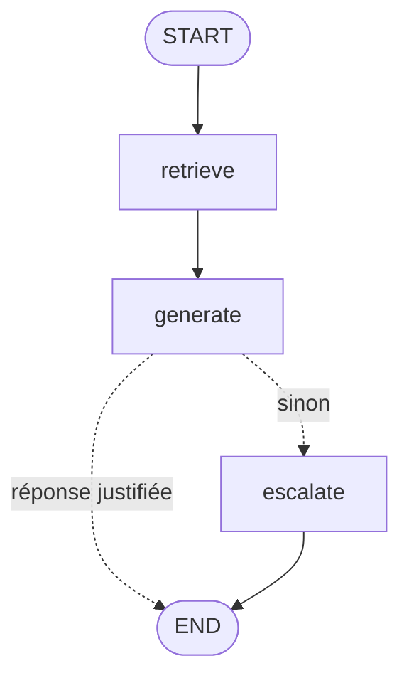

# Agent support LangGraph

Agent de support **RAG** construit avec **LangGraph** : il répond aux questions sur la
documentation de LangGraph en citant ses sources, et **transmet à un humain** quand la
documentation ne couvre pas la question, plutôt que d'inventer une réponse.

```
$ python -m support_agent "Comment persister l'état d'un graphe avec SQLite ?"
Pour persister l'état d'un graphe avec SQLite, on utilise le module
`langgraph.checkpoint.sqlite` qui implémente un checkpoint saver compatible SQLite.
Il offre à la fois un support synchrone et asynchrone via `aiosqlite`, ce qui le rend
adapté au développement local, aux tests ou aux déploiements légers.

Sources : 04_checkpoint_sqlite.md, 03_checkpoint.md, 05_checkpoint_postgres.md

$ python -m support_agent "Comment déployer LangGraph sur Kubernetes ?"
Je ne trouve pas cette information dans la documentation. Je transmets votre question à un humain.
```

## Architecture



| Nœud | Rôle |
|---|---|
| `retrieve` | Recherche sémantique des 4 chunks les plus proches (Chroma + embeddings NVIDIA `nemotron-3-embed-1b`). |
| `generate` | **Un seul** appel LLM en sortie structurée : sujet, citation, décision, réponse. |
| *router* | Répond seulement si le modèle dit pouvoir répondre **et** si sa citation existe vraiment dans les documents (vérifié en code). |
| `escalate` | Message de transfert, ou en mode `--hitl` : **pause du graphe** (`interrupt`) jusqu'à la réponse d'un opérateur humain. |

Stack : LangGraph 1.2 · LangChain · Chroma · NVIDIA NIM (`nemotron-3.5-lightning-30b-a3b`) · pytest · GitHub Actions.

## Choix de conception

### 1. Une décision typée plutôt qu'un mot-clé dans du texte

Première version : le LLM répondait en texte libre, ou écrivait `ESCALADE`, et un
router cherchait ce mot. C'est fragile dans les deux sens :

- **faux positifs** : le mot apparaît dans une réponse légitime, ou dans le
  raisonnement du modèle ;
- **faux négatifs** : le modèle refuse en prose (« le contexte ne fournit pas... »)
  sans écrire le marqueur.

Le LLM renvoie maintenant un objet validé par un schéma Pydantic
(`with_structured_output`) :

```python
class Decision(BaseModel):
    subject: str      # 1. sujet précis de la question
    evidence: str     # 2. citation MOT POUR MOT du contexte
    can_answer: bool  # 3. décision
    answer: str       # 4. réponse
```

**L'ordre des champs est délibéré** : un LLM génère dans l'ordre du schéma. Il doit
donc nommer le sujet et trouver une preuve *avant* de décider. C'est une forme de
raisonnement minimal, sans le coût d'un mode « thinking ».

### 2. Ne pas croire le modèle sur parole : vérification de la citation

`is_grounded()` vérifie, **sans LLM**, que la citation du modèle figure littéralement
dans un des documents récupérés. La comparaison tolère la casse, la ponctuation et les
liens markdown, mais rejette une paraphrase ou une invention. Si le modèle affirme
pouvoir répondre en s'appuyant sur une citation qui n'existe pas, l'agent escalade
quand même. C'est un garde-fou déterministe contre les hallucinations, couvert par
les tests unitaires.

### 3. Désactiver le raisonnement du modèle : mesurer avant de choisir

`nemotron-3.5-lightning` est un *reasoning model*. Par défaut, il écrit une longue
chaîne de pensée avant de répondre. Sur des prompts RAG longs, le budget de tokens
était épuisé **avant** la réponse finale : la réponse était vide, et le connecteur la
remplaçait par le raisonnement. Le mot « ESCALADE », cité dans ce raisonnement,
faisait alors escalader l'agent à tort.

| Variante testée | Latence | Tokens générés | Résultat |
|---|---|---|---|
| Raisonnement actif | 14,6 s | 469 | réponse correcte, mais lente |
| `/no_think` dans le prompt | 14,4 s | 486 | consigne **ignorée** |
| `chat_template_kwargs={"enable_thinking": False}` | **3,5 s** | **43** | réponse directe ✅ |

Leçon : une consigne dans le prompt ne garantit rien, alors que le paramètre officiel
du modèle, si.

### 4. Ingestion

- **Découpage** : découpage markdown (`MarkdownTextSplitter`, 500 caractères,
  50 de chevauchement).
- **Filtrage** : les chunks de moins de 80 caractères, réduits à un simple titre, sont
  écartés, car ils occupaient des places du top-k sans apporter de réponse.
- **Idempotence** : l'ingestion réinitialise la collection à chaque exécution, ce qui
  évite les doublons.

## Évaluation

`evals/` contient 15 cas, dont 10 questions couvertes par la doc et 5 hors doc. Chaque
cas est réussi si **la décision** (répondre ou escalader) est la bonne et, pour une
réponse, si elle contient le mot-clé attendu.

| Version | Score | Couvertes | Hors doc | Latence médiane |
|---|---|---|---|---|
| Marqueur texte + raisonnement actif | escalades à tort, timeouts à 60 s | | | > 60 s |
| Marqueur texte, raisonnement coupé | le modèle invente une procédure Kubernetes | | | |
| Sortie structurée + citation vérifiée | 12/15 | 8/10 | 4/5 | 12,3 s |
| + sujet explicite, liens markdown normalisés | **15/15** (2 exécutions) | **10/10** | **5/5** | 6–10 s |

```bash
python evals/run_evals.py --verbose   # code de sortie 1 si un cas échoue
```

> Latence mesurée sur l'API gratuite NVIDIA, avec des pics ponctuels à 60–90 s côté
> serveur. Même à `temperature=0`, le modèle n'est pas parfaitement déterministe :
> l'éval doit être relancée plusieurs fois avant de conclure.

## Lancer le projet

```bash
python -m venv .venv && source .venv/bin/activate
pip install -e ".[dev]"
cp .env.example .env              # puis renseigner NVIDIA_API_KEY (gratuit sur build.nvidia.com)

python -m support_agent.ingest    # construit l'index Chroma depuis data/
python -m support_agent "À quoi sert ToolNode ?"
python -m support_agent --hitl "Quel est le prix de LangSmith ?"   # escalade vers un humain
```

## Tests

```bash
pytest -q                          # 12 tests, hors-ligne (LLM et retriever factices)
ruff check src tests evals
```

Les tests couvrent la vérification des citations, le routage, le refus du modèle, la
citation inventée, l'absence de documents (aucun appel LLM) et le cycle
pause/reprise du human-in-the-loop. La CI GitHub Actions lance lint et tests à chaque
push. L'éval de bout en bout se déclenche manuellement (secret `NVIDIA_API_KEY`).

## Structure

```
src/support_agent/
├── config.py      # paramètres, surchargeables par variables d'environnement
├── providers.py   # clients NVIDIA (LLM, embeddings) + retriever Chroma
├── graph.py       # le graphe LangGraph, le schéma Decision, la vérification des citations
├── ingest.py      # data/*.md -> chunks -> embeddings -> Chroma
└── __main__.py    # CLI
tests/             # tests unitaires hors-ligne
evals/             # éval de bout en bout (cases.yaml + run_evals.py)
data/              # corpus : README officiels de LangGraph (MIT, voir data/SOURCE.md)
```

## Limites et pistes

- **Corpus réduit** (8 README, 124 chunks) : beaucoup de questions légitimes sur
  LangGraph sont hors corpus et escaladent. Étape suivante : ingérer la documentation
  complète.
- **Retrieval purement vectoriel** : un retrieval hybride (BM25 + embeddings) ou un
  reranker aiderait sur les noms d'API exacts (`SqliteSaver`, `ToolNode`).
- **Pas de mémoire multi-tours** : chaque question est indépendante. LangGraph le
  permet via un checkpointer et un `thread_id`, avec une reformulation de la question
  à partir de l'historique.
- **Éval par mot-clé** : simple et reproductible, mais grossière. Une notation par
  LLM-juge mesurerait la fidélité de la réponse au contexte.
